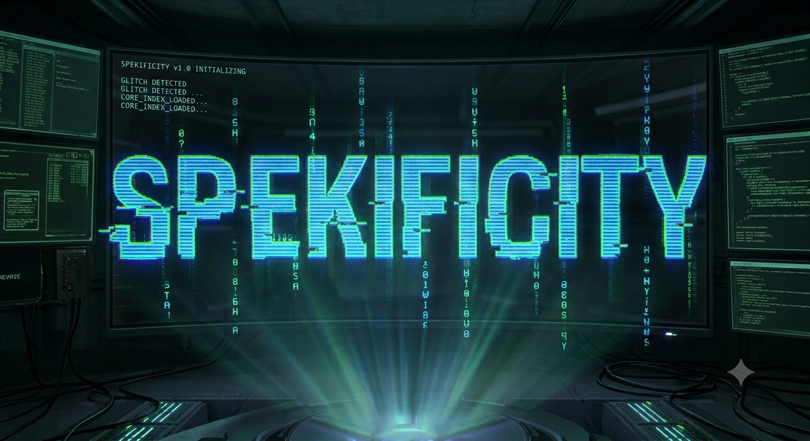

<p align="center">
  
</p>

Spekificity is a spec-driven agent development framework. It glues four best-in-class tools (Obsidian vault, lat.md code graph, SpecKit workflow, Caveman compression) into one coordinated system. One setup command (`spek init`), then use agent skills inside your AI editor (Claude Code, Copilot, Gemini, etc.) to develop features with persistent architecture context, deterministic workflows, and token efficiency.

---

## Quick Start

**Prerequisites** (install manually; check with `tool --version`)
- Python 3.10+
- `uv` 0.1+ ([astral.sh/uv](https://docs.astral.sh/uv/))
- Node.js 18+
- Git 2.0+

**1. Install CLI**
```bash
uv tool install spekificity --from git+https://github.com/marcelrienks/spekificity.git
```

**2. Initialize project**
```bash
cd /path/to/your/project
spek init .
```
Select agent integration (claude, copilot, gemini, cursor-agent, windsurf, cline, etc.) and script type. Done — all tools auto-installed.

**3. Run in your AI editor**
Inside Claude Code, Copilot, or other agent:
```
/spek.prepare
/spek.plan "feature description"
/spek.implement
/spek.conclude
```

**Next:** [wiki/workflow.md](wiki/workflow.md) — 4-stage feature workflow.

---

## Key Features

- **Spec-Driven Workflow** — All work starts with structured specification
- **Persistent Memory** — Decisions, patterns, lessons stored in Git-backed vault
- **Token Efficiency** — Pre-indexed code analysis (lat.md) + Caveman compression
- **Deterministic Sequencing** — 4-stage workflow (Prepare → Plan → Implement → Conclude)
- **Composable Skills** — `/spek.*` commands designed to be chainable or independently runnable
- **11 Agent Integrations** — Claude Code, Copilot, Gemini, Cursor, Windsurf, Cline, Codex, Kiro, Amp, Qwen, generic
- **Anti-Sycophancy Validation** — Detects spec contradictions and AI drift against vault history
- **Backprop Reflex** — Captures test failure patterns into vault automatically

---

**Update:** `uv tool upgrade spekificity`

**Detailed setup:** [wiki/setup.md](wiki/setup.md)

---

## Documentation

- **[wiki/workflow.md](wiki/workflow.md)** — 4-stage feature workflow (prepare → plan → implement → conclude)
- **[wiki/skills.md](wiki/skills.md)** — All 9 agent skills (`/spek.*` command reference)
- **[wiki/architecture.md](wiki/architecture.md)** — How components fit together
- **[wiki/setup.md](wiki/setup.md)** — Detailed setup for special cases (Obsidian CLI, MCP config, git hooks)
- **[wiki/conventions.md](wiki/conventions.md)** — File naming, directory structure
- **[wiki/decision.md](wiki/decision.md)** — 9 architectural decisions + trade-offs
